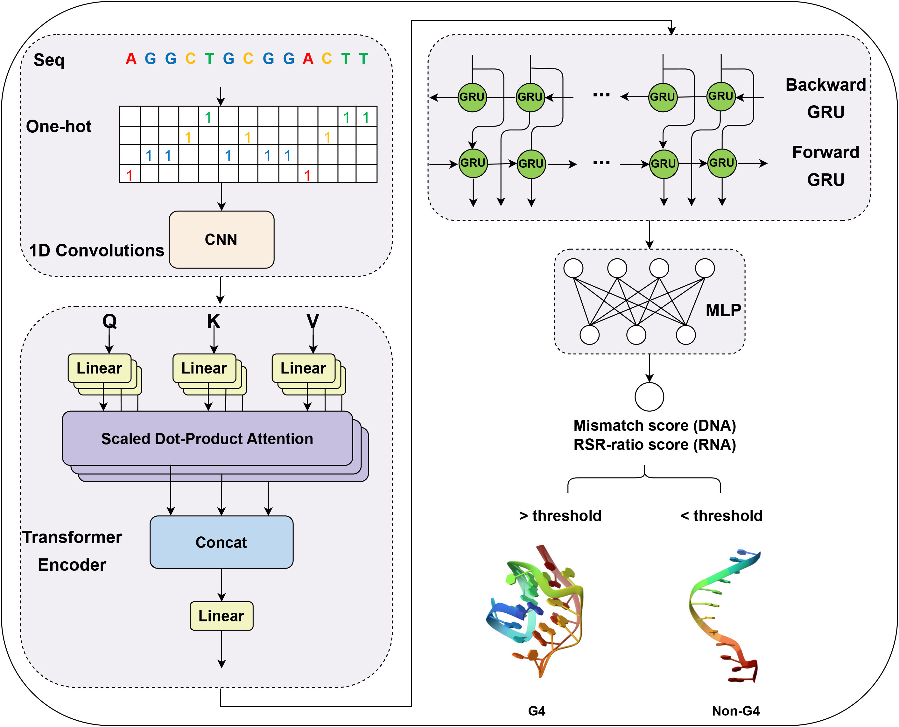

# TransG4

We present TransG4, a tool for predicting the mismatch score of DNA or RSR-ratio of RNA. 
<div align=center></div>


## Preparing the environment
```
TensorFlow 2.3.0
numpy 1.18.5
pandas 1.4.1
matplotlib 3.2.1
seaborn 0.13.1
scikit-learn 0.24.0
jupyter 1.0.0

if tensorflow is the gpu version:
cudatoolkit 10.1.243
cudnn 7.6.5
```

### Usage

* To run TransG4 on G4-seq data, you can run the train.ipynb notebook in the G4 folder. Before that, you need to prepare G4-seq file and human genome data file (hg19). `The G4-seq data` can be downloaded throught pred_data.sh, while `the hg19` is available on https://hgdownload.soe.ucsc.edu/downloads.html.
* All data for rG4-seq can be found in /rG4/data. The result can be reproduced by running the train.ipynb file.
